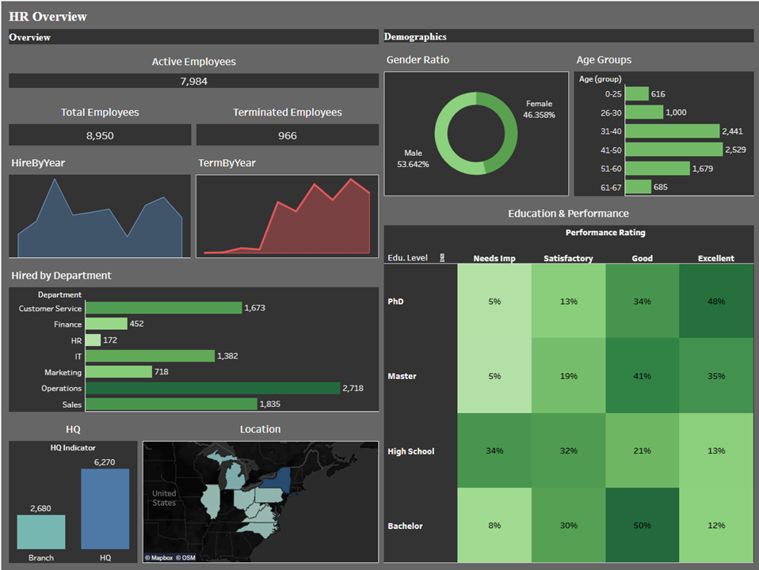

# HR Employee Dashboard — Tableau

## Overview
An interactive HR analytics dashboard built in Tableau, designed to provide HR managers with both high-level workforce summaries and detailed demographic insights.

**Live Dashboard:** [View on Tableau Public](https://public.tableau.com/views/HROverviewProject/Dashboard1)

---

## Dashboard Preview

The dashboard is divided into two main sections:

**Overview**
- Total hired, active, and terminated employees
- Hiring and termination trends over time (2015–2024)
- Employee distribution by department
- HQ vs. Branch headcount comparison
- Geographic distribution across US states

**Demographics**
- Gender ratio
- Employee distribution by age group
- Correlation between education level and performance rating

---

## Dataset

| Property | Value |
|---|---|
| Source | Synthetic HR dataset |
| Records | 8,950 employees |
| Fields | 14 columns |
| Format | CSV (semicolon delimited) |

**Fields:** Employee_ID, First Name, Last Name, Gender, State, City, Education Level, Birthdate, Hiredate, Termdate, Department, Job Title, Salary, Performance Rating

---

## Calculated Fields

| Field | Formula | Purpose |
|---|---|---|
| Active Employees | `IF ISNULL([Termdate]) THEN 1 ELSE 0 END` | Employees without a termination date |
| Terminated Employees | `IF NOT ISNULL([Termdate]) THEN 1 ELSE 0 END` | Employees with a termination date |
| Age | `DATEDIFF('year', [Birthdate], TODAY())` | Current age calculated from birthdate |
| HQ Indicator | `IF [State] = 'New York' THEN 'HQ' ELSE 'Branch' END` | Classifies employees by HQ or branch location |
| Age (bin) | Auto-generated bin (size: 4) | Groups employees into age ranges |

---

## Key Insights

- **8,950** total employees — **7,984** active, **966** terminated
- **PhD holders** show the strongest performance: 48% rated Excellent
- **High School graduates** show the weakest performance: 34% rated Needs Improvement
- **2017** was the peak hiring year with 1,560 new employees
- **2023** had the highest terminations: 174 employees
- **Operations** is the largest department (2,718 employees)
- Gender split: 53.6% Male / 46.4% Female

---

## Tools & Technologies

- **Tableau Desktop Public Edition**
- **Tableau Public** (publishing)
- **CSV** data source

---

## Files

| File | Description |
|---|---|
| `HR Dashboard.csv` | Source dataset (8,950 records) |
| `HR_Employee_Dashboard.twbx` | Tableau packaged workbook |

---

## Author

**Nemi Yossef Hai**
[LinkedIn](https://www.linkedin.com/in/nemi-yossef-hai) · nemiys@gmail.com
